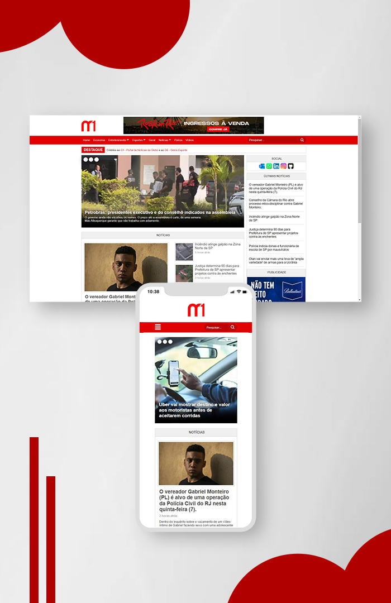

  

 

<h1>M1 - Portal de Notícias</h1>

<h3 align = "center">
  Projeto desenvolvido para estudos
   Inspirado no G1
</h3>

<h4 align = "center">
	versão 1.2 ✅
</h4>
 
<h3 align = "center">
<a href="https://matealves.github.io/portaldenoticias/" target="_blank">Acesse o site - clique aqui!
</a> 
</h3>

 

 <a href="#visao">• Visão geral</a>  
 <a href="#leng">• Linguagens</a>  
 <a href="#contato">• Contato</a>  

 
 

<h1>  Visão geral </h1>
Um portal de notícias desenvolvido do zero, inspirado nas páginas do <strong>G1</strong>, projeto com o objetivo de trabalhar responsividade (layout se adapta em vários tamanhos de tela), simular a adição de publicidades no site e organização do layout em geral. Imagens e logotipo modelados no Photoshop.

 
 
 

<h1>  Skills utilizadas </h1>

 
  
  

 
 
 

<h1> Como entro em contato? </h1>

Entre em contato através dos links a seguir!
 
 

 
 
 